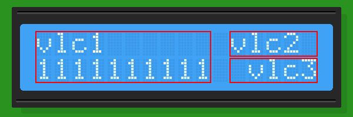
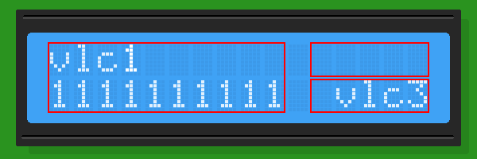

# Root4root_VLC (Virtual Liquid Crystal)

Arduino 1602/1604 LCD Helper with state cache to reduce MCU->LCD transfer.



### Available Methods:
```cpp
Root4root_VLC(T *lcdHandler, uint8_t chars, uint8_t lines, uint8_t offsetX, uint8_t offsetY);

void setLine(uint8_t line, bool resetX = true);
void setCursor(uint8_t x = 0, uint8_t y = 0);
void displayString(const char *str);
void write(uint8_t symbol);
void clear();

void setDelayTime(uint16_t delay);
void resetDelayCounter();
```

### Dependencies:
```cpp
//Root4root_VLC depends on methods from injected library:
setCursor(uint8_t, uint8_t);
write(uint8_t);
```

### Example:

```cpp
#include <Arduino.h>
#include <LiquidCrystal_I2C.h>

#include "Root4root_VLC.h"

LiquidCrystal_I2C lcd(0x27, 16, 2);

Root4root_VLC<LiquidCrystal_I2C> vlc1(&lcd, 10, 2, 0, 0);
Root4root_VLC<LiquidCrystal_I2C> vlc2(&lcd, 5, 1, 11, 0);
Root4root_VLC<LiquidCrystal_I2C> vlc3(&lcd, 5, 1, 11, 1);

char container[6] = {0};

void setup()
{
    lcd.init();
    lcd.backlight();
}

void loop()
{
    vlc1.displayString("vlc1");
    vlc1.setLine(1);
    vlc1.displayString("1111111111");
    delay(1000);

    vlc2.displayString("vlc2");
    delay(1000);

    sprintf(container,"%5s", "vlc3");
    vlc3.displayString(container);
    delay(1000); //Figure above


    vlc2.clear();
    delay(1000); //Figure below
    vlc3.clear();
    delay(1000);
    vlc1.clear();

    delay(5000);
}
```



### License:
MIT
### Author:
Paul aka root4root \<root4root at gmail dot com><br/>
**Any comments/suggestions are welcomed.**
